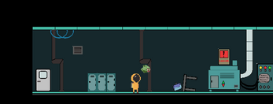
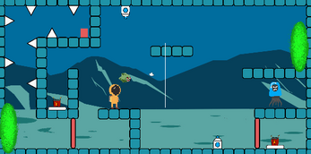
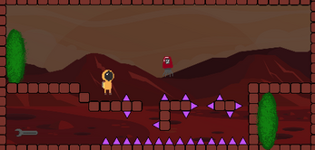

# SPACE Y : ASTRO'S ROAD

This game was made for HUJAM '22 in 72 hours.

The vehicles  of  Astro and  his allien  friend , which  were travelling  in spacecraft , were broken.Gather the  necessary materials  now and  help fix it!

## Game Screen

## Play Demo and Installation
https://melih-kir.itch.io/space-y-astros-road

# CONTROLS
ESC : Menu

W : Jump 

D : move right

A : Move left

E : Interaction with portals and doors

SPACE : Switching between characters 

Mouse Left Button : Shoot

# ASSETS
Player : https://assetstore.unity.com/packages/2d/characters/free-pixel-space-platform-pa...

GameBackground : https://www.freepik.com/free-vector/mars-landscape-alien-planet-martian-backgrou...

MainMenu Background :https://www.freepik.com/free-vector/gradient-galaxy-with-stars-background_156951...

# SFX
Shoot : https://www.kenney.nl/assets/interface-sounds

Jump and game music :https://mixkit.co/free-sound-effects/game/

# CREDITS

Berna GÜNEY : https://itch.io/profile/bernagny

https://www.linkedin.com/in/berna-guney-0382a2180/

Eyüp ECE : https://www.linkedin.com/in/ey%C3%BCp-ece-9230a7211/

Batuhan ALTINEL : https://itch.io/profile/batium

https://www.linkedin.com/in/batuhan-altinel/

Melih KIR :https://melih-kir.itch.io

https://www.linkedin.com/in/melih-kir-3aa168238/
